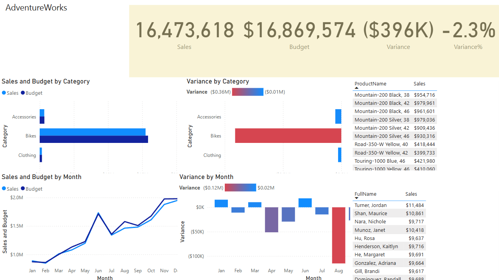

# Retail Sales Dashboard – Power BI Project

This project is a business intelligence dashboard created using **Power BI Desktop** as part of a guided practice following the tutorial by *Alex the Analyst*.

🔗 Tutorial followed: [Power BI Tutorial – From Beginner to Pro](https://www.youtube.com/watch?v=AGrl-H87pRU)

---

## 📊 Project Objective

To develop a fully interactive sales dashboard that helps stakeholders:
- Track KPIs such as Total Revenue, Profit, and Quantity Sold
- Visualize sales performance across regions, categories, and time
- Identify trends and outliers using slicers and filters

---

## 📁 Dataset Overview

Sample retail dataset containing:
- Order details (Order ID, Product, Date)
- Sales and profit metrics
- Region and segment breakdowns

---

## 🛠️ Tools Used

- Power BI Desktop
- Power Query for data cleaning and transformation
- DAX for calculated fields and KPIs
- Slicers, maps, bar charts, and cards for visuals

---

## 📸 Dashboard Preview

> *(Insert screenshot image of your dashboard here)*  

---

## 💡 Key Skills Practiced

- Data cleaning and transformation using Power Query
- Data modeling and relationship mapping
- DAX measures and calculated columns
- Interactive dashboard design
- Business storytelling with visuals

---

## 🔍 Future Improvements

- Integrate with live data source
- Add advanced DAX metrics (e.g., YoY Growth)
- Use bookmarks and tooltips for UX enhancements

